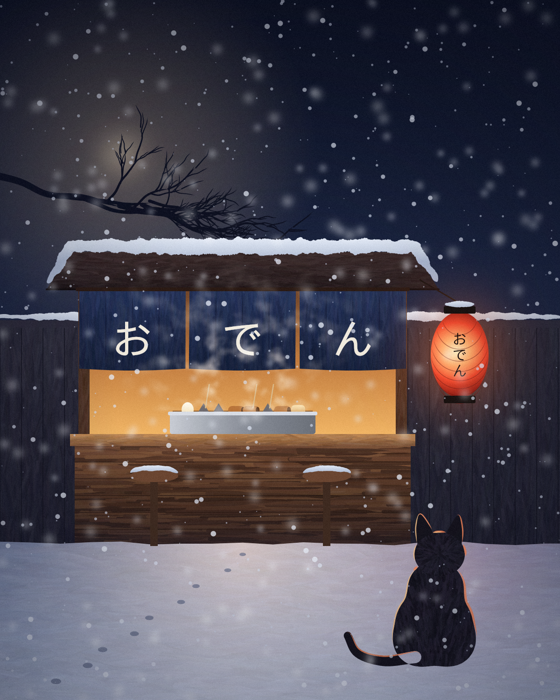

# claude-drawing

Claude が自分で使うための headless お絵描きツール。

**ギャラリー: https://furugomu.github.io/claude-drawing/**
シーンを JS で書き → PNG にレンダリング → 自分の目（画像読み込み）で見て → 直す、のループで絵を描く。



## 使い方

```sh
node bin/draw.js new my-piece                  # works/my-piece.js を作る
node bin/draw.js render works/my-piece.js      # → out/my-piece.png
node bin/draw.js render works/my-piece.js --debug        # + 座標グリッド・mark・guide 入り
node bin/draw.js render works/my-piece.js --only sky,sea # レイヤーを絞って速く確認
node bin/draw.js look out/my-piece.png                   # 明度・ノタン(5階調)・サムネイルのシート
node bin/draw.js look out/my-piece.png --crop 700,1100,400,360   # 拡大（元画像座標のグリッド付き）
node bin/draw.js compare a.png b.png           # 並べて比較
node bin/draw.js seeds works/my-piece.js --count 9       # シード違いを一覧
node bin/draw.js anim works/my-piece.js --frames 36 --fps 12 --format mp4  # 動く絵 + 確認用フィルムストリップ
```

生成物は `out/`（git 管理外）。完成品は `gallery/` にコピーする。
ギャラリーページは `docs/`（GitHub Pages）。`gallery/` を更新したら `npm run site` で `docs/img/` の WebP を作り直し、`docs/index.html` に作品を足す。

## シーンの書き方

```js
export const meta = { title: '...', width: 1600, height: 1000, seed: 1, background: '#f4efe4' };

export default function (t) {
  const { W, H, curve, circle, rect, linear } = t;   // ヘルパーは全部 t に入っている
  const sky = t.layer('sky', (p) => {                 // p = Painter。レイヤーごとに独立した p.rng
    p.fillPainted(rect(0, 0, W, 600), linear(0, 0, 0, 600, ['#141833', '#f6c48f']));
  });
  t.layer('sea', { blend: 'multiply', alpha: 0.9 }, (p) => {
    p.reflect([sky], { axis: 600 });                  // レイヤーは Painter を返すので再利用できる
  });
}
```

- 座標は常に「デザインピクセル」（meta.width × meta.height）。
- 乱数はレイヤー名から派生するので、あるレイヤーを編集しても他のレイヤーの乱数は変わらない。
- 配置は定数に名前を付けて（`HORIZON`, `DECK`, `LANTERN` …）そこから全部を導くと崩れにくい。

## API 早見表

### 形（`Shape` = 点列 + closed フラグ）
| 作る | |
|---|---|
| `curve(pts, {closed})` | 点を**通る**滑らかな曲線（centripetal Catmull-Rom）。有機的な線の基本 |
| `circle / ellipse / rect(x,y,w,h,r) / regular / star / arc / line / shape(pts) / polyline` | 基本図形 |
| `blob(cx,cy,r,{rng,n,vary})` | ランダムな有機形 |
| `blobUnion([[x,y,r],...], {blend})` | 円の滑らかな合体（メタボール）。雲・岩・動物の胴体 |
| `contour(fn, {bounds, level})` | スカラー場の等高線 → 形の配列 |
| `thick(curve, width \| fn(u))` | 曲線を太さのある帯に（尻尾・枝・川） |
| `ribbon(spine, right, left)` | 左右で太さが違う帯（魚の胴・ひれ・葉） |
| `trace(angleFn, x, y, {length})` | 流れ場に沿った線 |
| `poisson(region, r, {rng})` | 均等にばらけた点 |
| `perspective({horizon, cx, eye, focal})` | カメラ。`cam.at(X, Z, Y)` で地面・水面上の位置（メートル）→画面座標。`cam.place(shape, X, Z, {mirror})` で立った物とその映り込み |

| 変形・問い合わせ | |
|---|---|
| `.translate .rotate .scale .reverse .close .open` | rotate/scale の既定の中心は重心 |
| `.resample(step) .smooth(n)` | 等間隔化・角を丸める |
| `.wobble(amt, {rng, freq})` | 手描きの揺らぎ |
| `.deform(rounds, amt, {rng})` | 水彩的なギザギザ |
| `.offset(d)` | 法線方向に押し出し（閉図形は外向き正） |
| `.facing(angle, {min, exclude})` | **その方向を向いている輪郭部分**（リムライト・雪・ハイライト） |
| `.facingPoint(x, y, {min, maxDist})` | 点光源の方を向いている輪郭部分 |
| `.where(pred)` | 条件を満たす輪郭部分 |
| `.frames(n \| {spacing})` | 等間隔の位置＋法線（歯・棘・縫い目・葉を並べる） |
| `.sub(t0,t1) .at(t) .frame(t) .bounds() .contains(x,y) .length .area()` | |

### 描く（Painter `p`）
| | |
|---|---|
| `fill(shapes, paint, {alpha, blend, rule, shadow})` | paint は色文字列か `linear/radial/conic(...)`（OKLab で補間） |
| `stroke(shapes, paint, width)` | 均一線 |
| `ink(shape, {width, taper, pressure, wobble})` | 入り抜きのある線。線画の主力 |
| `brush(shape, {width, color, dry, streaks})` | ガッシュ風の筆。`dry` でかすれ |
| `pencil(shape, {width, grain})` | 紙の凹凸に沿う鉛筆 |
| `wash(shape, {color, spread, edge, bloom, granulation, soft})` | 水彩のにじみ |
| `strokes(shape, {angle \| fn, colors, width, length, tool})` | **領域を筆致で埋める**。colors にグラデーションを渡すとその場の色を拾う |
| `fillPainted(shape, paint, opts)` | 塗り＋同じ色の筆致（ベタ塗りを絵にする一発技） |
| `hatch(shape, {angle, spacing, cross})` | ハッチング |
| `glow(shapes, color, radius)` | 発光（任意の形。ぼかしフィルタなので重い） |
| `dot(x, y, r, color, {blur})` | 丸い点・ぼけた点。星・雪・粒子はこちら（glow の約100倍速い） |
| `raster(fn(x,y)→[r,g,b,a], {bounds, res})` | 手続き的な場（天の川・湯気・霧） |
| `reflect(layers, {axis, ripple, fade})` | 水面反射 |
| `illuminate(x, y, r, color, {blend})` | 点光源。**既に描いたものにだけ**当たる（空間は暗いまま） |
| `lens(shape, layer, {zoom, invert, base, blend})` | 水滴・ガラス玉。背後を反転・縮小して映す |
| `snowcap(shape, depth)` | 上向きの縁に積もる雪 |
| `rim(parts, angle \| [x, y], {color, width})` | 部品の集まり（人物など）のリムライト。他の部品に隠れた輪郭は除く |
| `ripple({from, amount, wavelength})` | 描いたものを行ごとに揺らす（水面の映り込み） |
| `warp(fn \| {amount, scale})` | 描いたものを変位場で歪める（水面下の屈折・陽炎・古いガラス） |
| `branch(x, y, angle, len, width, {depth})` | 再帰的な枝。先端の点を返す |
| `vignette(strength, {cx, cy})` / `grain(amt)` / `paper()` | 仕上げ |
| `group(opts, fn)` / `clip(shape, fn)` / `at(x, y, {rotate, scale}, fn)` / `with(opts, fn)` | 合成・マスク・ローカル座標 |
| `scope(name, fn)` | その中だけ独立した乱数。前に描いたものや道具の変更に影響されない |
| `text(str, x, y, {size, font, align})` | `font: 'IPAGothic'` で日本語 |
| `mark(name, x, y)` / `guide(shape, label)` | `--debug` 時だけ見える目印 |

### 動く絵
シーンは `t.time`（0→1 でひと回り）を読めば動く。静止画のときは 0。
| | |
|---|---|
| `t.time` / `t.frame` / `t.frames` | ループ内の位置・コマ番号・総コマ数 |
| `t.wave(freq, phase)` | ループする sin 波。`freq` は整数（ループ内の回数） |
| `t.loopOffset(r, freq, phase)` | 半径 r の円をひと回りする点。ノイズの座標に足すと模様が動いて元に戻る |
| `warp({ shift: t.loopOffset(0.6) })` | 揺らぎを動かす |

`draw anim` はコマを `out/anim/<名前>/` に書き、ffmpeg で MP4 / アニメーション WebP にし、
`out/<名前>.strip.png`（等間隔のコマを並べた確認用）も作る。動きはフィルムストリップと、
一部を拡大したコマの並べ比較（`look --crop` → `compare`）で確かめる。

### 色
`mix(a, b, t)`（OKLab）, `lighten / darken / saturate / shiftHue / alpha / adjust`, `jitter(c, rng)`, `ramp(stops, t)`, `oklch(l, c, h)`, `rgba(c)` / `mixRgba`（raster 用）

## 描き方のコツ（使いながら分かったこと）

1. **まず `--debug` と `look --crop`**。座標で描くので、拡大して座標を読むのが一番効く。
2. **ノタン（5階調）で明暗を確認**。色相だけで目立っているものはノタンで消える。光源は明度で一番明るく。
3. **輪郭は「意味」で選ぶ**。`sub(0.52, 0.8)` のような数値は形が変わると壊れる。`facing(光の方向)` なら壊れない。
4. **ベタ塗りは `fillPainted`/`strokes` で絵にする**。グラデーションから色を拾う筆致で画面全体の質感が揃う。
5. **柔らかいもの（光・霧・星雲）は `raster`**。筆致や図形の重ね塗りでは塊っぽくなる。
6. **キャラクターは部品を分けて重ねる**。頭と胴を一つのメタボールにすると首が溶ける。部品ごとに作り、`facing({exclude})` でリムライト。
7. **光は足し算**。発光・照明は `screen` より `lighter`（加算）の方が「当たっている」感じが出る。
8. **見えない参照レイヤー**。`t.layer('city', { alpha: 0 }, ...)` で描いておけば、画面には出さずに `lens` や `reflect` の元にできる。
9. **おかしいと思ったら `--only` / `--skip` で切り分け**。スキップしたレイヤーは空の Painter を返すので依存レイヤーも動く。
10. **気に入った偶然は `scope` で守る**。同じレイヤー内の乱数は前の描画に依存するので、枝ぶりなど形が大事な要素は `p.scope('名前', ...)` で囲う。名前を変えると別の形を試せる。
11. **速度は `node bench/strokes.js` で測る**。筆の重さは「ストローク呼び出しの頂点数」でほぼ決まる。
